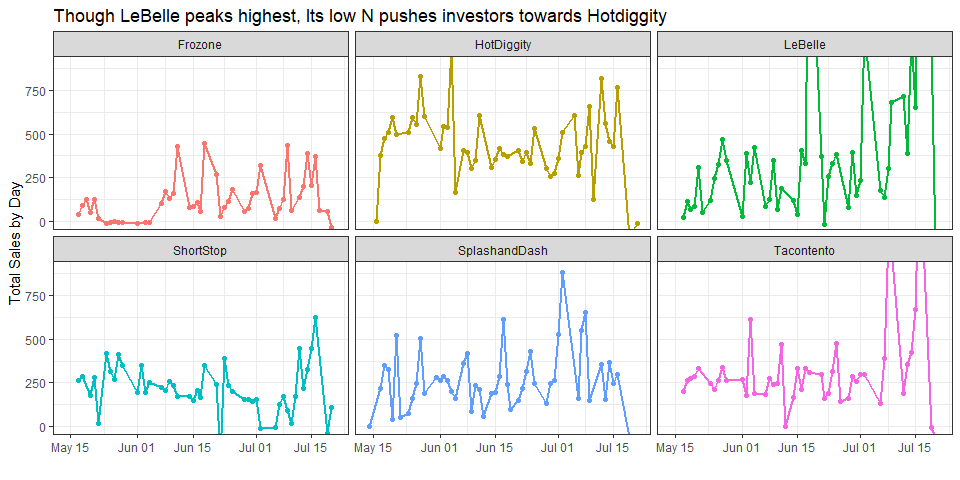
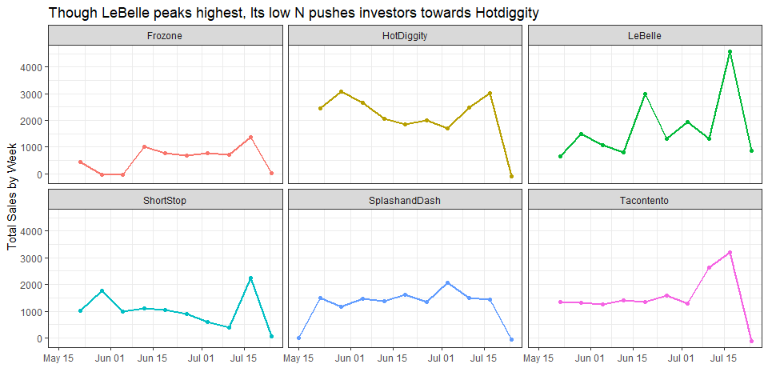
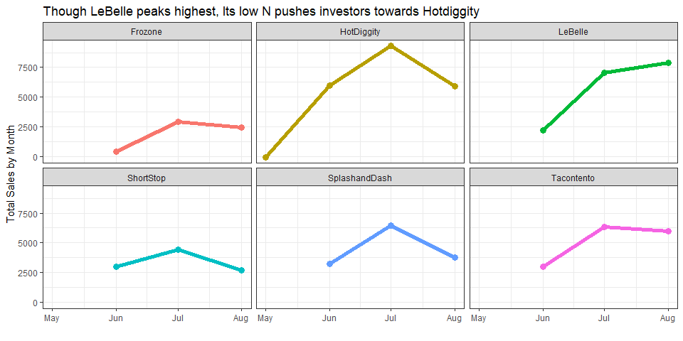
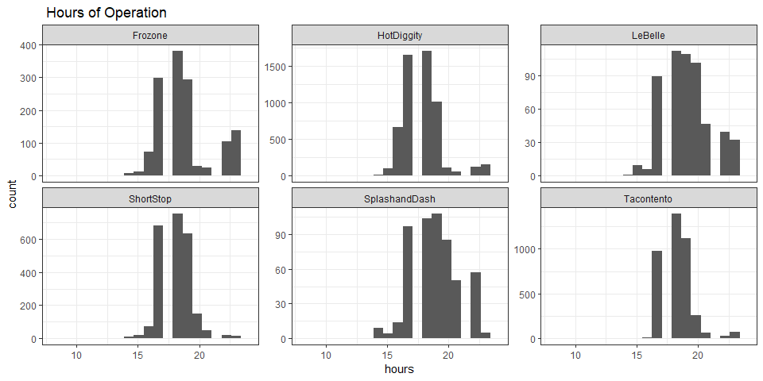
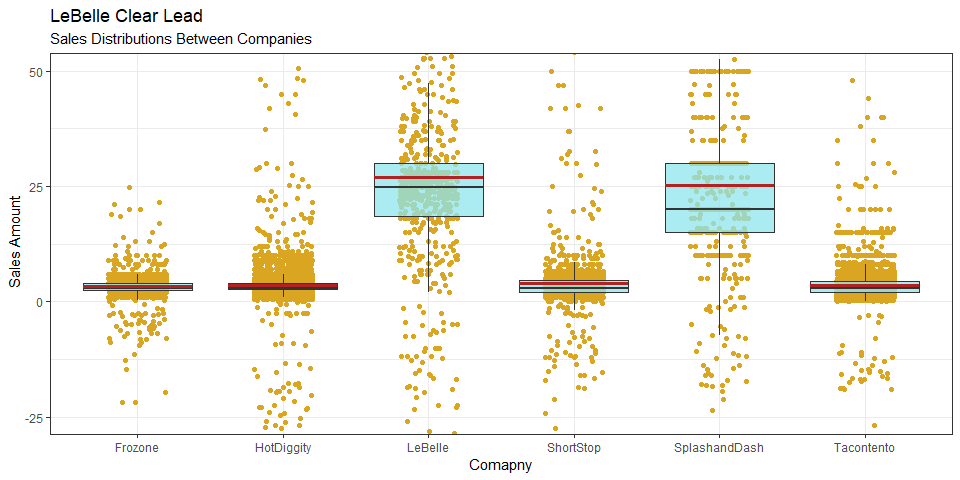

## Wrangling


```r
#[ ] This is point of sale (pos) data, so you will need to use library(lubridate) to create the correct time aggregations

datt <- dat %>%
  mutate(Day = (ceiling_date(MDT, unit = "days"))) %>% 
  mutate(Week = (ceiling_date(MDT, unit = "week"))) %>% 
  mutate(Month = (ceiling_date(MDT, unit = "month"))) %>% 
  mutate(Hour = (ceiling_date(MDT, unit = "hour")))
  


datd <- datt %>% 
  group_by(Day, Type, Name) %>% 
  summarise(Tsales = sum(Amount))


datw <- datt %>% group_by(Week, Type, Name) %>% 
  summarise(Tsales = sum(Amount))

dath <- datt %>% group_by(Hour, Type, Name) %>% 
  summarise(Tsales = sum(Amount))

datm <- datt %>% group_by(Month, Type, Name) %>% 
  summarise(Tsales = sum(Amount))
```

## Visualization

From these time aggregations it really seems like Hotdiggity is the way to go. We have seen that the number of sales by LeBelle is smaller than that of Hotdiggity. 


```r
#[ ] Help your boss understand which business is the best investment through visualizations
datt %>% 
  group_by(Name) %>% 
  summarise(Sales = n()) %>% 
  mutate(Sales = as.factor(Sales)) %>% 
  kable(caption = "Number of Sales for each Company")
```


Table: Number of Sales for each Company

Name            Sales 
--------------  ------
Frozone         1674  
HotDiggity      5887  
LeBelle         634   
ShortStop       2593  
SplashandDash   533   
Tacontento      4333  

```r
datd %>% 
  filter(Day != "2016-04-21") %>% 
  ggplot(aes(x = Day ,y = Tsales, color = Name)) +
  theme_bw() +
  geom_point() +
  coord_cartesian(ylim = c(0, 900)) +
  geom_line(aes(group = Name), size = 1) +
  facet_wrap(~Name) +
  theme(legend.position = "none" ) +
  labs(x = "", y = " Total Sales by Day", title = "Though LeBelle peaks highest, Its low N pushes investors towards Hotdiggity")
```

<!-- -->

```r
datw %>% 
  filter(Week != "2016-04-24") %>% 
  ggplot(aes(x = Week ,y = Tsales, color = Name)) +
  theme_bw() +
  geom_point() +
  geom_line(aes(group = Name), size = 1) +
  facet_wrap(~Name) +
  theme(legend.position = "none" ) +
  labs(x = "", y = " Total Sales by Week ", title = "Though LeBelle peaks highest, Its low N pushes investors towards Hotdiggity")
```

<!-- -->

```r
datm %>% 
  filter(Month != "2016-04-24") %>% 
  ggplot(aes(x = Month ,y = Tsales, color = Name)) +
  theme_bw() +
  geom_point(size = 3) +
  geom_line(aes(group = Name), size = 2) +
  facet_wrap(~Name) +
  theme(legend.position = "none" ) +
  labs(x = "", y = " Total Sales by Month ", title = "Though LeBelle peaks highest, Its low N pushes investors towards Hotdiggity")
```

<!-- -->


```r
#[ ] Provide an understanding and recommendation for hours of operation

datt %>% 
  mutate(hour = hour(Time)) %>% 
  ggplot(aes(x = hour),fill = "purple4") +
  geom_histogram() +
  theme_bw() +
  coord_cartesian(xlim = c(8, 24)) +
  facet_wrap(~Name, scales = "free_y") +
  labs(title = " Hours of Operation", x = "hours", fill = "")
```

<!-- -->

Seems as though Splash and Dash is open about 3-11, Fronzone from 3-11, shortstop from 3 to 8:30ish, Hotdiggity from 4 to 8ish, LeBelle from 5 to 11 and tocontento from 4 to 8ish. 


```r
#[ ] We don’t have employee numbers, but sales traffic can help. Provide some visualizations on customer traffic

#datt %>% 
  #group_by(Name) %>% 
  #summarise(Sales = n()) %>% 
  #mutate(Sales = as.factor(Sales)) %>% 
  #kable(caption = "Number of Sales for each Company")
```

## Invest in LeBelle

In a final visualization, I wanted to compare what the average revenue of sale is. These box plots have a red line for mean and show that in general the revenue for sale is a lot better for LeBelle, Though there are fewer sales the magnitude seems to be larger. LeBelle sells goods and therefore may be a better year-round investment. I would suggest investing in LeBelle. 


```r
#[ ] Provide a final comparison of the six companies and a final recommendation

datt %>% 
  ggplot(aes(x = Name, y = Amount )) +
  geom_jitter(width = .2, color = "goldenrod") +
  geom_boxplot(outlier.shape = NA, fill = "cadetblue2", alpha = .75) +
  theme_bw() +
  stat_summary(fun.y = mean, geom = "errorbar", aes(ymax = ..y.., ymin = ..y..),
               width = .75, color = "firebrick", size = 1.3) +
  labs(x = "Comapny", y =" Sales Amount",title = "LeBelle Clear Lead", subtitle = "Sales Distributions Between Companies") +
  coord_cartesian(ylim = c(-25, 50)) 
```

<!-- -->


