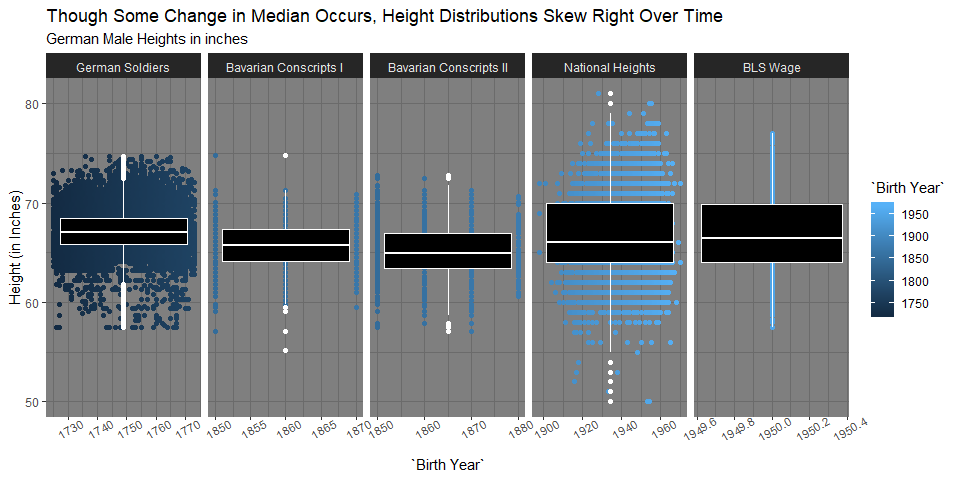

## Wrangle Data


```r
bob0 <- tempfile()
download("https://byuistats.github.io/M335/data/heights/Height.xlsx", bob0, mode = "wb")
dat <- read_xlsx(bob0, skip = 2) %>% 
  gather(`1800`:`2011`, key = "Year_Decade", value = "Height_cm" ) %>% 
  filter(!is.na(Height_cm)) %>% 
  rename(Country = `Continent, Region, Country`) %>% 
  separate(Year_Decade, c("Century-1","Decade","Year"), sep = c(2,3), remove = FALSE) %>% 
  mutate(Height_in = conv_unit(Height_cm, from = "cm", to = "inch")) 
```


```r
BLSHT <- read_csv("https://github.com/hadley/r4ds/raw/master/data/heights.csv") %>% 
  select(height) %>% 
  rename(Height_in = height) %>% 
  mutate(Height_cm = conv_unit(Height_in, from = "inch", to = "cm")) %>% 
  mutate(birth_year = 1950) %>% 
  mutate(study_id = "BLS Wage")
```


```r
nsHT <- read_sav("http://www.ssc.wisc.edu/nsfh/wave3/NSFH3%20Apr%202005%20release/main05022005.sav") %>% 
  select(DOBY,RT216I, RT216F) %>% 
  filter(RT216F >= 4) %>% 
  filter(RT216I < 12 & RT216I > -1) %>% 
  mutate(RT216F = RT216F * 12) %>% 
  mutate(Height_in = RT216F + RT216I)
nsH <- nsHT %>% select(DOBY, Height_in) %>% mutate(Height_cm = conv_unit(Height_in, from = "inch", to = "cm")) %>% 
  mutate(study_id = "National Heights") %>% 
  mutate(birth_year = DOBY + 1900) %>% 
  select(birth_year, Height_in, Height_cm, study_id)
```


```r
germcon <- read_dta("https://byuistats.github.io/M335/data/heights/germanconscr.dta") %>% 
  select(bdec, height) %>% 
  rename(birth_year = bdec) %>% 
  rename(Height_cm = height) %>% 
  mutate(Height_in = conv_unit(Height_cm, from = "cm", to = "inch")) %>% 
  mutate(study_id = "Bavarian Conscripts II")
```


```r
germpri <- read_dta("https://byuistats.github.io/M335/data/heights/germanprison.dta") %>% 
  select(bdec, height) %>% 
  rename(Height_cm = height) %>% 
  rename(birth_year = bdec) %>% 
  mutate(Height_in = conv_unit(Height_cm, from = "cm", to = "inch")) %>% 
  mutate(Height_cm = Height_cm) %>% 
  mutate(study_id = "Bavarian Conscripts I")
```


```r
seasol <- read.dbf("../../data/B6090.DBF") %>% 
  select(RECNO, CMETER,GEBJ) %>% 
  rename(Height_cm = CMETER) %>% 
  rename(birth_year = GEBJ) %>% 
  rename(study_id = RECNO) %>%
  mutate(Height_in = conv_unit(Height_cm, from = "cm", to = "inch")) %>% 
  mutate(study_id = "German Soldiers")
```


```r
Heights <- bind_rows(seasol, germpri, germcon, nsH, BLSHT)
```

## Height Over Time - World Data

  The following graphic represents the distribution of heights in the world. It is quite clear that the median height has increased about 2.5 inches from 181`0 to 1980. Germany has experienced a more dramatic rise of about 5 inches. Germany is included to be compared with the plot that follows.


```r
dat1 <- filter(dat, Country == c("Germany", "Federal Republic of Germany (until 1990)")) %>% 
  mutate(Century = case_when(
  `Century-1` == 18 ~ "1800's",
  TRUE ~ "1900's"
))


dat %>% mutate(Century = case_when(
  `Century-1` == 18 ~ "1800's",
  TRUE ~ "1900's"
)) %>% 
  ggplot() +
  geom_violin(aes(Decade, Height_in), fill = "goldenrod1") +
  geom_boxplot(aes(Decade, Height_in), fill = "darkorchid1", width =.5, outlier.color = "goldenrod1") +
  geom_point(data = dat1, aes(Decade, Height_in, color = "Germany"), size = 3, shape = 15) +
  facet_wrap(~`Century`, scale = "free_x", nrow = 1) +
  theme_dark() +
  scale_y_continuous(breaks = seq(60, 75, by = 5)) +
  labs(y = "Height in inches", title = "Distribution of Male World Heights from 1810 to Present")
```

<!-- -->

## Height Over Time - Germany

  It has been hypothesized that height increases over time. The following data from several surveys in Germany suggests that median height has not been increasing over time, but average height has. These distributions of the heights in different surveys seem to suggest that the maximum height increases by about a foot, and that the distributions become more right skewed. The curve represents the mean height by year, the BLS data is only for the year 1950 therefore an overtime mean cannot be computed. 


```r
Heights$study_id <- 
  factor(Heights$study_id, levels = c("German Soldiers", "Bavarian Conscripts I", "Bavarian Conscripts II", "National Heights", "BLS Wage")) 

Heights %>% 
  rename(`Study ID` = study_id) %>% 
  rename(`Birth Year` = birth_year) %>% 
  ggplot() +
  geom_point(aes(`Birth Year`, Height_in, color = `Birth Year`)) +
  geom_boxplot(aes(`Birth Year`, Height_in), fill = "black", color = "white") +
  facet_wrap(~`Study ID`, scale = "free_x", nrow = 1) +
  theme_dark() +
  labs(y = "Height (in Inches)", title = "Though Some Change in Median Occurs, Height Distributions Skew Right Over Time", subtitle = "German Male Heights in inches") +
  theme(axis.text.x = element_text(angle = 30))
```

<!-- -->

