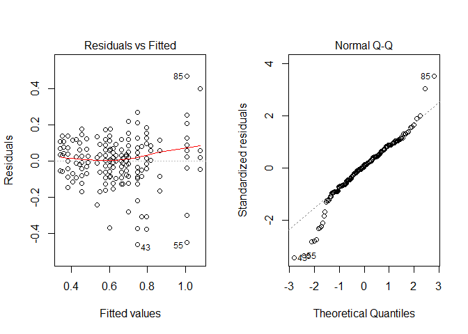
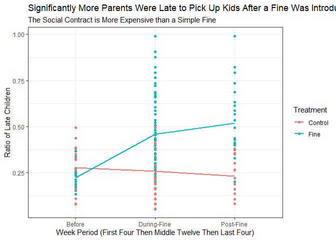

<script type="text/javascript">
 function showhide(id) {
    var e = document.getElementById(id);
    e.style.display = (e.style.display == 'block') ? 'none' : 'block';
 }
</script>


----

<!--If you want to give your critiquers some ideas about what you have questions on and would like help with, place those details here.-->


<!--End your comments to your critiquers before this line.-->

----


## Background {.tabset .tabset-fade}

### Overview
<!-- Be sure to add your own background here before beginning the Analysis. -->


<!--End your background before here.-->
<!--Click the little black arrow to 
the left to expand/hide these next sections.-->
### Study Details

<div style="color:#a8a8a8;">
This background is quoted directly from the article ["A Fine is a Price"](http://rady.ucsd.edu/faculty/directory/gneezy/pub/docs/fine.pdf). 
</div>

<div style="padding-left:30px; padding-right:30px;">

There are two types of day-care centers in Israel: private and public. A study was conducted in 10 private day-care centers in the city of Haifa from January to June 1998. All of these centers are located in the same part of town, and there is no important difference among them. During the day children are organized into groups according to age, from 1 to 4 years old. Each day-care center is allowed to hold a maximum of 35 children. In some exceptional cases a few additional children are allowed. The fee for each child is NIS 1,400 per month. (The NIS is the New Israeli Shekel.) At the time of the study, a U.S. dollar was worth approximately NIS 3.68, so the fee was about $380 at that time. 

The contract signed at the beginning of the year states that the day-care
center operates between 0730 and 1600. There is no mention of what happens if parents come late to pick up their children. In particular, before the beginning of the study, there was no fine for coming late. When parents did not come on time, one of the teachers had to wait with the children concerned. Teachers would rotate in this task, which is considered part of the job of a teacher, a fact that is clearly explained when a teacher is hired. Parents rarely came after 1630. 

A natural option [to fix the problem of parents showing up late] is to introduce a fine: every time a parent comes late, [they] will have to pay a fine. Will that reduce the number of parents who come late? If the fine is removed, will things revert back to the way they were originally?

The overall period of the study was 20 weeks. In the first 4 weeks we
simply recorded the number of parents who arrived late each week. At the
beginning of the fifth week, we introduced a fine in six of the 10 day-care centers, which had been selected randomly. The announcement of the fine was made with a note posted on the bulletin board of the day-care center. Parents tend to look at this board every day, since important announcements are posted there. The announcement specified that the fine would be NIS 10 for a delay of 10 minutes or more. The fine was per child; thus, if parents had two children in the center and they came late, they had to pay NIS 20. Payment was made to the principal of the day-care center at the end of the month. Since monthly payments are made to the owner during the year, the fines were added to those amounts. The money was paid to the owner, rather then to the teacher who was staying late (and did not get any additional money). The teachers were informed of the fine but not of the study. Registering the names of parents who came late was a common practice in any case.

At the beginning of the seventeenth week, the fine was removed with no explanation. Notice of the cancellation was posted on the board. If parents asked why the fines were removed, the principals were instructed to reply that the fine had been a trial for a limited time and that the results of this trial were now being evaluated.

A comparison with other fines in Israel may give an idea of the size of
the penalty that was introduced. A fine of NIS 10 is relatively small but not insignificant. In comparison, the fine for illegal parking is NIS 75; the fine for driving through a red light is NIS 1,000 plus penalties; the fine for not collecting the droppings of a dog is NIS 360. For many of these violations, however, detection and enforcement are low or, as in the case of dog dirt, nonexistent in practice. A baby-sitter earns between NIS 15 and NIS 20 per hour. The average gross salary per month in Israel at the time of the study was NIS 5,595.

</div>


### The Data (Wide)


The `late` Day Care Center data is shown here in the "wide data format". 


```r
#Show the full width of the "Wide" version of the late data:
pander(late, split.tables = Inf)
```


--------------------------------------------------------------------------------------------------------------------------------------------------------------------------------------------------------------
 Treatment   Center   No.ofChidren   Week1   Week2   Week3   Week4   Week5   Week6   Week7   Week8   Week9   Week10   Week11   Week12   Week13   Week14   Week15   Week16   Week17   Week18   Week19   Week20 
----------- -------- -------------- ------- ------- ------- ------- ------- ------- ------- ------- ------- -------- -------- -------- -------- -------- -------- -------- -------- -------- -------- --------
   Fine        1           37          8       8       7       6       8       9       9      12      13       13       15       13       14       16       14       15       16       13       15       17   

   Fine        2           35          6       7       3       5       2      11      14       9      16       12       10       14       14       16       12       17       14       10       14       15   

   Fine        3           35          8       9       8       9       3       5      15      18      16       14       20       18       25       22       27       19       20       23       23       22   

   Fine        4           34         10       3      14       9       6      24       8      22      22       19       25       18       23       22       24       17       15       23       25       18   

   Fine        5           33         13      12       9      13      15      10      27      28      35       10       24       32       29       29       26       31       26       35       29       28   

   Fine        6           28          5       8       7       5       5       9      12      14      19       17       14       13       10       15       14       16       6        12       17       13   

  Control      7           35          7      10      12       6       4      13       7       8       5       12       3        5        6        13       7        4        7        10       4        6    

  Control      8           34         12       9      14      18      10      11       6      15      14       13       7        12       9        9        17       8        5        11       8        13   

  Control      9           34          3       4       9       3       3       5       9       5       2       7        6        6        9        4        9        2        3        8        3        5    

  Control      10          32         15      13      13      12      10       9      15      15      15       10       17       12       13       11       14       17       12       9        15       13   
--------------------------------------------------------------------------------------------------------------------------------------------------------------------------------------------------------------


### The Data (Long)

The `Late` Day Care Center data is shown here in the "long data format".


```r
# This code reshapes the data into "long" format called Late.
# To get the "Late" dataset into your R Console, 
# you need to click the green "play" arrow in 
# the top right corner of this gray R-Chunk. 
# Then type:
#   > View(Late)
# in your R Console
Late <- reshape(late,
                varying = paste("Week",1:20, sep=""), 
                v.names = "No.ofLateChildren",
                timevar = "Week", 
                times = 1:20, 
                idvar = "Center",
                new.row.names = 1:200,
                direction = "long")
pander(Late)
```


--------------------------------------------------------------
 Treatment   Center   No.ofChidren   Week   No.ofLateChildren 
----------- -------- -------------- ------ -------------------
   Fine        1           37         1             8         

   Fine        2           35         1             6         

   Fine        3           35         1             8         

   Fine        4           34         1            10         

   Fine        5           33         1            13         

   Fine        6           28         1             5         

  Control      7           35         1             7         

  Control      8           34         1            12         

  Control      9           34         1             3         

  Control      10          32         1            15         

   Fine        1           37         2             8         

   Fine        2           35         2             7         

   Fine        3           35         2             9         

   Fine        4           34         2             3         

   Fine        5           33         2            12         

   Fine        6           28         2             8         

  Control      7           35         2            10         

  Control      8           34         2             9         

  Control      9           34         2             4         

  Control      10          32         2            13         

   Fine        1           37         3             7         

   Fine        2           35         3             3         

   Fine        3           35         3             8         

   Fine        4           34         3            14         

   Fine        5           33         3             9         

   Fine        6           28         3             7         

  Control      7           35         3            12         

  Control      8           34         3            14         

  Control      9           34         3             9         

  Control      10          32         3            13         

   Fine        1           37         4             6         

   Fine        2           35         4             5         

   Fine        3           35         4             9         

   Fine        4           34         4             9         

   Fine        5           33         4            13         

   Fine        6           28         4             5         

  Control      7           35         4             6         

  Control      8           34         4            18         

  Control      9           34         4             3         

  Control      10          32         4            12         

   Fine        1           37         5             8         

   Fine        2           35         5             2         

   Fine        3           35         5             3         

   Fine        4           34         5             6         

   Fine        5           33         5            15         

   Fine        6           28         5             5         

  Control      7           35         5             4         

  Control      8           34         5            10         

  Control      9           34         5             3         

  Control      10          32         5            10         

   Fine        1           37         6             9         

   Fine        2           35         6            11         

   Fine        3           35         6             5         

   Fine        4           34         6            24         

   Fine        5           33         6            10         

   Fine        6           28         6             9         

  Control      7           35         6            13         

  Control      8           34         6            11         

  Control      9           34         6             5         

  Control      10          32         6             9         

   Fine        1           37         7             9         

   Fine        2           35         7            14         

   Fine        3           35         7            15         

   Fine        4           34         7             8         

   Fine        5           33         7            27         

   Fine        6           28         7            12         

  Control      7           35         7             7         

  Control      8           34         7             6         

  Control      9           34         7             9         

  Control      10          32         7            15         

   Fine        1           37         8            12         

   Fine        2           35         8             9         

   Fine        3           35         8            18         

   Fine        4           34         8            22         

   Fine        5           33         8            28         

   Fine        6           28         8            14         

  Control      7           35         8             8         

  Control      8           34         8            15         

  Control      9           34         8             5         

  Control      10          32         8            15         

   Fine        1           37         9            13         

   Fine        2           35         9            16         

   Fine        3           35         9            16         

   Fine        4           34         9            22         

   Fine        5           33         9            35         

   Fine        6           28         9            19         

  Control      7           35         9             5         

  Control      8           34         9            14         

  Control      9           34         9             2         

  Control      10          32         9            15         

   Fine        1           37         10           13         

   Fine        2           35         10           12         

   Fine        3           35         10           14         

   Fine        4           34         10           19         

   Fine        5           33         10           10         

   Fine        6           28         10           17         

  Control      7           35         10           12         

  Control      8           34         10           13         

  Control      9           34         10            7         

  Control      10          32         10           10         

   Fine        1           37         11           15         

   Fine        2           35         11           10         

   Fine        3           35         11           20         

   Fine        4           34         11           25         

   Fine        5           33         11           24         

   Fine        6           28         11           14         

  Control      7           35         11            3         

  Control      8           34         11            7         

  Control      9           34         11            6         

  Control      10          32         11           17         

   Fine        1           37         12           13         

   Fine        2           35         12           14         

   Fine        3           35         12           18         

   Fine        4           34         12           18         

   Fine        5           33         12           32         

   Fine        6           28         12           13         

  Control      7           35         12            5         

  Control      8           34         12           12         

  Control      9           34         12            6         

  Control      10          32         12           12         

   Fine        1           37         13           14         

   Fine        2           35         13           14         

   Fine        3           35         13           25         

   Fine        4           34         13           23         

   Fine        5           33         13           29         

   Fine        6           28         13           10         

  Control      7           35         13            6         

  Control      8           34         13            9         

  Control      9           34         13            9         

  Control      10          32         13           13         

   Fine        1           37         14           16         

   Fine        2           35         14           16         

   Fine        3           35         14           22         

   Fine        4           34         14           22         

   Fine        5           33         14           29         

   Fine        6           28         14           15         

  Control      7           35         14           13         

  Control      8           34         14            9         

  Control      9           34         14            4         

  Control      10          32         14           11         

   Fine        1           37         15           14         

   Fine        2           35         15           12         

   Fine        3           35         15           27         

   Fine        4           34         15           24         

   Fine        5           33         15           26         

   Fine        6           28         15           14         

  Control      7           35         15            7         

  Control      8           34         15           17         

  Control      9           34         15            9         

  Control      10          32         15           14         

   Fine        1           37         16           15         

   Fine        2           35         16           17         

   Fine        3           35         16           19         

   Fine        4           34         16           17         

   Fine        5           33         16           31         

   Fine        6           28         16           16         

  Control      7           35         16            4         

  Control      8           34         16            8         

  Control      9           34         16            2         

  Control      10          32         16           17         

   Fine        1           37         17           16         

   Fine        2           35         17           14         

   Fine        3           35         17           20         

   Fine        4           34         17           15         

   Fine        5           33         17           26         

   Fine        6           28         17            6         

  Control      7           35         17            7         

  Control      8           34         17            5         

  Control      9           34         17            3         

  Control      10          32         17           12         

   Fine        1           37         18           13         

   Fine        2           35         18           10         

   Fine        3           35         18           23         

   Fine        4           34         18           23         

   Fine        5           33         18           35         

   Fine        6           28         18           12         

  Control      7           35         18           10         

  Control      8           34         18           11         

  Control      9           34         18            8         

  Control      10          32         18            9         

   Fine        1           37         19           15         

   Fine        2           35         19           14         

   Fine        3           35         19           23         

   Fine        4           34         19           25         

   Fine        5           33         19           29         

   Fine        6           28         19           17         

  Control      7           35         19            4         

  Control      8           34         19            8         

  Control      9           34         19            3         

  Control      10          32         19           15         

   Fine        1           37         20           17         

   Fine        2           35         20           15         

   Fine        3           35         20           22         

   Fine        4           34         20           18         

   Fine        5           33         20           28         

   Fine        6           28         20           13         

  Control      7           35         20            6         

  Control      8           34         20           13         

  Control      9           34         20            5         

  Control      10          32         20           13         
--------------------------------------------------------------


 
##  
<!-- You can begin writing again after here.-->


## Analysis

It is a common misconception, that the introducing of fines leads to a decrease in the activity fined. Whether it be the idea that fines somehow condone the activity and 'just paying the fine' or just a general lack of regard to fines in general.

After 20 weeks of data was collected on these ten day care centers, one can easily interpret from a simple graph that there is a large difference in behavior between centers. We can eliminate time as a factor, because of our control groups.

In order to normalize the data and appropriate it for the ANOVA test, we took the ratio of late children to total children at each center each week. We then used an arcisn of the square root conversion to normalize the data. This had only a relatively beneficial effect, as we will see.

Ten centers does not allow us to show a decent graphical representation or spread of the data, though a table is provided above.

Our analysis will use the normalized data, and compare it between two groups, with an added blocking factor of the individuality of the centers.

Our null hypothesis is that there will be no difference between the means of the late children ration of the centers, no mater the treatment group. This will be shown as follows:

$$
  H_0: {\text{The means are equal between treatment groups and fine periods blocking for individual centers}}  
$$
$$
H_a: {\text{The means are not equal between treatment groups and fine periods blocking for individual centers}}
$$
We will now perform the ANOVA test.


```r
Late$Ratio <- Late$No.ofLateChildren/Late$No.ofChidren/1.07
Late$Normal <- asin(sqrt(Late$Ratio))

Late$Weekgroup <- cut(Late$Week, c(.9,4,16,20), labels=c("Before","During-Fine","Post-Fine"))
 
Late$CNTRgroup <- cut(Late$Center, c(0,6,10), labels=c("Fine","Control"))
LateAOV <- aov(Normal ~ as.factor(Center)+Weekgroup:Treatment, data=Late)
pander(summary(LateAOV))
```


------------------------------------------------------------------------
         &nbsp;            Df    Sum Sq   Mean Sq   F value    Pr(>F)   
------------------------- ----- -------- --------- --------- -----------
  **as.factor(Center)**     9     4.86     0.54      28.88    5.469e-31 

 **Weekgroup:Treatment**    4    1.586    0.3965     21.2     2.02e-14  

      **Residuals**        186   3.478    0.0187      NA         NA     
------------------------------------------------------------------------

Table: Analysis of Variance Model

```r
par(mfrow=c(1,2))
plot(LateAOV, which=1:2)
```

<!-- -->

Though the variance looks fairly good, the tails at the ends of the qq-plots defy normality. Though our data seems to be very conclusive due to the ANOVA test, take it with a grain of salt as ANOVA works under the premise of normality. 

The F-statistic, or ANOVA test statistic, is quite high, leaving our p-values to have significance only at about the 12th decimal place. It is safe to conclude that both the individual centers caused significant differences, as well as treatments and time periods.


###Interpretation


Now that we have arrived at the conclusion that there are truly differences is the averages, due both to treatment and the week-period, let us examine where the difference is with an xy-plot.


```r
#xyplot(Ratio ~ Weekgroup, data=Late, groups=Treatment, type=c("p","a"), main="Significance of the Interaction", auto.key=list(corner=c(1,1)))

Late %>% 
  ggplot() +
  geom_point(aes(x = Weekgroup, y = Ratio, color = Treatment)) +
  geom_smooth(aes(x = Weekgroup, y = Ratio, color = Treatment, group = Treatment), se = FALSE) +
  theme_bw() +
  labs(x = "Week Period (First Four Then Middle Twelve Then Last Four)", y = "Ratio of Late Children", title = "Significantly More Parents Were Late to Pick Up Kids After a Fine Was Introduced.", subtitle = "The Social Contract is More Expensive than a Simple Fine")
```

```
## `geom_smooth()` using method = 'loess' and formula 'y ~ x'
```

```
## Warning in simpleLoess(y, x, w, span, degree = degree, parametric =
## parametric, : pseudoinverse used at 0.99
```

```
## Warning in simpleLoess(y, x, w, span, degree = degree, parametric =
## parametric, : neighborhood radius 1.01
```

```
## Warning in simpleLoess(y, x, w, span, degree = degree, parametric =
## parametric, : reciprocal condition number 0
```

```
## Warning in simpleLoess(y, x, w, span, degree = degree, parametric =
## parametric, : There are other near singularities as well. 1.0201
```

```
## Warning in simpleLoess(y, x, w, span, degree = degree, parametric =
## parametric, : pseudoinverse used at 0.99
```

```
## Warning in simpleLoess(y, x, w, span, degree = degree, parametric =
## parametric, : neighborhood radius 1.01
```

```
## Warning in simpleLoess(y, x, w, span, degree = degree, parametric =
## parametric, : reciprocal condition number 0
```

```
## Warning in simpleLoess(y, x, w, span, degree = degree, parametric =
## parametric, : There are other near singularities as well. 1.0201
```

<!-- -->

Significantly more children were left to stay late after the fine was introduced. Though the center number is not included in the plot, it was clearly also a large factor, as blocking for the variable caused a unique change in our results. 

Though our normality is questionable, we reject the null and concluded that the introduction of a fine will in fact lead to a larger number of children left late. This may be useful information specifically for the owner as far as making more money for the center goes. It is possible, however,  that a better analysis and test could be performed considering again the normality.

-----------------------------------------------------------------------------------
