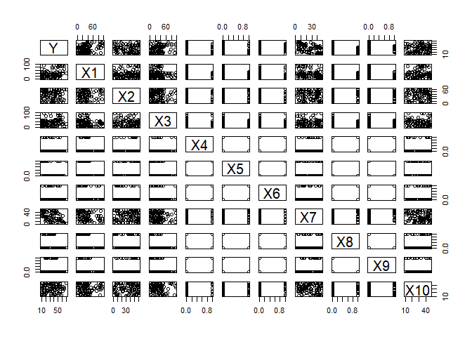
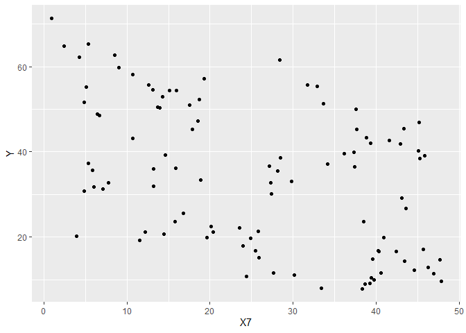
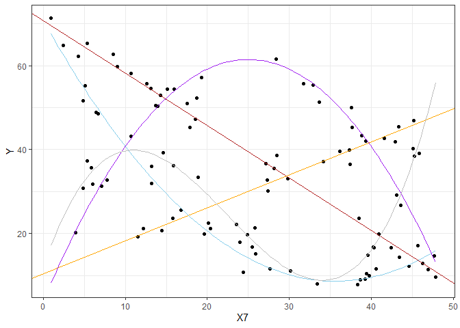

```r
library(tidyverse)
library(pander)
```


## Creating your Data {.tabset .tabset-fade .tabset-pills}

Remember the rules...

### Rules

1. Your csv must contain 11 columns of data.
    * The first column must be your (1) Y-variable (labeled as "Y").
    * The other ten columns must be (10) X-variables (labeled as "X1", "X2", ... , "X10").
    
2. Your Y-variable (or some transformation of the Y-variable) must have been created from a linear regression model using only X-variables (or transformations of those X-variables) from within your data set.
    * Be very careful with transformations. You must ensure that you do not break the rules of a linear regression if you choose to use transformations.
    * If you choose transformations, only these functions are allowed when transforming X and Y variables: 1/Y^2, 1/Y, log(Y), sqrt(Y), Y^2, Y^3, 1/X^2, 1/X, log(X), sqrt(X), X^2, X^3, X^4, X^5. Don't forget to check Rule #3 carefully if you choose transformations.
    
3. Your sample size must be sufficiently large so that when the true model is fit to your data using lm(...), all p-values of X-variable terms (not including the intercept) found in the summary(...) are significant.

4. Plot the model in 2D space


### True Model

The model Statement is as follows:

---

$\hat{Y_i} = Y$

---

$X_1i = X7$

----

$X_2i = X9$

----

$X_3i = X3$

----

$X_4i = X5$

----

$X_5i = X8$


Write out your final "true" model in mathematical form. Make sure it matches your code.

$$
\hat{Y_i} = \beta_0 + \beta_1X_{1i} + \beta_2X_{2i} + \beta_3X_{1i}X_{2i} + \beta_4X_{3i} + \beta_5X_{1i}X_{3i} + \beta_6(X_{1i})^2X_{3i} +\\  \beta_7X_{1i}X_{4i} + \beta_8(X_{1i})^2X_{4i} + \beta_9X_{5i} + \beta_{10}X_{1i}X_{5i} + \beta_{11}(X_{1i})^2X_{5i} + \beta_{12}(X_{1i})^3X_{5i} 
$$


### The Code to Make the Data


```r
set.seed(23)

#one X_i for each line

n <- 100
X_1i <- runif(n, 0, 48) 
dumcre <- runif(n, 0, 100)

dat <- data.frame(X7 = X_1i, dumcre) %>% 
  mutate(X9 = case_when(
    dumcre < 20 ~ 1,
    TRUE ~ 0
  )) %>% 
  mutate(X1 = case_when(
    dumcre < 40 & dumcre > 20 ~ runif(100,50,100),
    TRUE ~ runif(100,0,49)
  )) %>% 
  mutate(x1 = case_when(
    dumcre < 40 & dumcre > 20 ~ 1,
    TRUE ~ 0
  )) %>% 
  mutate(X3 = case_when(
    dumcre > 40 & dumcre < 60 ~ runif(100,50,100),
    TRUE ~ runif(100,0,49)
  )) %>% 
  mutate(x3 = case_when(
    dumcre > 40 & dumcre < 60 ~ 1,
    TRUE ~ 0
  )) %>% 
  mutate(X5 = case_when(
    dumcre > 60 & dumcre < 80 ~ 1,
    TRUE ~ 0
  )) %>% 
  mutate(X8 = case_when(
    dumcre > 80 ~ 1,
    TRUE ~ 0
  )) %>% 
  mutate(X10 = runif(n, 10, 48)) %>% 
  mutate(X2 = runif(n, 0, 62)) %>% 
  mutate(X4 = sample(c(0,1,0,0,0,0), n, replace = TRUE)) %>% 
  mutate(X6 = sample(c(0,0,0,1,0,0), n, replace = TRUE))


X_2i <- dat$X9
X_3i <- dat$x1
X_4i <- dat$x3
X_5i <- dat$X5
X_6i <- dat$X8


#Two Lines  = -1.25x+70 = .8x+10 

beta0 <- 70
beta1 <- -1.25

beta2 <- -60
beta3 <- 2.05

#beta 4 and 5 removed, see model statment for better organization of betas
#Two Quadratics = -.05x^2+4.5x-45 = .05x^2-3.5x+62

beta6 <- -65
beta7 <- 5.76
beta8 <- -.09

#beta9 <- -8 no longer being used
beta10 <- -2.25
beta11 <- .05

#Baseline - Cubic = .005x^3-.34x^2+5.745x+10.61
beta12 <- -59.39
beta13 <- 6.995 
beta14 <- -.34 
beta15 <- .005 


  
sigma <- 2

epsilon_i <- rnorm(n, 0, sigma) 

#Important Note - Beta 4 and 5 were removed, Beta 9 too close to zero to be used 

Y_i <- beta0 + beta1*(X_1i) + beta2*(X_2i) + beta3*(X_2i)*(X_1i) + beta6*(X_4i) + beta7*(X_4i)*(X_1i) + beta8*(X_4i)*(X_1i)^2 + beta10*(X_5i)*(X_1i) + beta11*(X_5i)*(X_1i)^2 + beta12*(X_6i) + beta13*(X_6i)*(X_1i) + beta14*(X_6i)*(X_1i)^2 + beta15*(X_6i)*(X_1i)^3 + epsilon_i 

791358
```

```
## [1] 791358
```

```r
fabData <- data.frame(cbind(Y =Y_i, dat)) %>% 
  select(Y, X1,X2,X3,X4,X5,X6, X7, X8, X9, X10)
pairs(fabData)
```

<!-- -->
  

```r
# Once you are ready, run this code to write your data to a csv:

#write_csv(fabData, "C:/Users/jasho/OneDrive/Desktop/SPRING2019/Statistics/Statistics-Notebook-master/Data/hidden.csv")
# The above code writes the dataset to your "current directory"
# To see where that is, use: getwd() in your Console.
# Find the data set and upload it to I-Learn.
```


```r
#Model Breaking Code


dat <- fabData %>% 
  mutate(x1 = case_when(
    X1 > 50 ~ 1,
    TRUE ~ 0
  )) %>% 
  mutate(x3 = case_when(
    X3 > 50 ~ 1,
    TRUE ~ 0
  ))

791358
```

```
## [1] 791358
```

```r
#  View(fabData) 
#pairs(fabData)
lm.j <- lm(Y ~ X7 + X9 + X7:X9 + x3 + X7:x3 + I(X7^2):x3 + X7:X5 + I(X7^2):X5 + X8 + X7:X8 + I(X7^2):X8 + I(X7^3):X8, data =dat)
pander(summary(lm.j))
```


---------------------------------------------------------------
     &nbsp;        Estimate   Std. Error   t value   Pr(>|t|)  
----------------- ---------- ------------ --------- -----------
 **(Intercept)**    70.82       0.7025      100.8    6.854e-92 

     **X7**         -1.254     0.03051     -41.09    9.313e-59 

     **X9**         -60.46      1.652      -36.59    1.29e-54  

     **x3**         -67.04      1.984      -33.78    8.531e-52 

     **X8**         -58.79      2.847      -20.65    2.686e-35 

    **X7:X9**        2.04      0.05424      37.61    1.374e-55 

    **X7:x3**       5.874       0.1832      32.06    5.782e-50 

 **x3:I(X7^2)**    -0.09245    0.00361     -25.61    2.758e-42 

    **X7:X5**       -2.239     0.07228     -30.97    9.189e-49 

 **I(X7^2):X5**     0.049      0.001839     26.65    1.27e-43  

    **X7:X8**       6.944       0.5019      13.84    1.083e-23 

 **I(X7^2):X8**    -0.3431     0.02392     -14.34    1.22e-24  

 **X8:I(X7^3)**    0.005087   0.0003213     15.83    2.394e-27 
---------------------------------------------------------------


--------------------------------------------------------------
 Observations   Residual Std. Error   $R^2$    Adjusted $R^2$ 
-------------- --------------------- -------- ----------------
     100               2.06           0.9869       0.9851     
--------------------------------------------------------------

Table: Fitting linear model: Y ~ X7 + X9 + X7:X9 + x3 + X7:x3 + I(X7^2):x3 + X7:X5 + I(X7^2):X5 + X8 + X7:X8 + I(X7^2):X8 + I(X7^3):X8

```r
b <- coef(lm.j)

#ggplot(fabData, aes(X7, Y)) +
  #geom_point() +
  #theme_bw() +
  #geom_abline(aes(intercept = 70, slope = -1.25), color = "firebrick", lwd = 1) +
  #geom_abline(aes(intercept = 10, slope = .8), color = "orange", lwd = 1) +
  #geom_abline(aes(intercept = 60, slope = 0), color = "green", lwd = 1) +
  #stat_function(fun = function(x)(5 + 4.5*x - .09*(x^2)), color = "skyblue", lwd = 1) +
  #stat_function(fun = function(x)(62 - 3.5*x + .05*(x^2)), color = "purple", lwd = 1) +
  #stat_function(fun = function(x)(10.61 + 5.745*x - .34*(x^2) + .005*(x^3)), color = "gray", lwd = 1) 
  
ggplot(dat, aes(x = X7, y = Y)) +
  geom_point()
```

<!-- -->

```r
ggplot(dat, aes(x = X7, y = Y)) +
  geom_point() +
  theme_bw() +
  geom_abline(aes(intercept = b[1], slope = b[2]), color = "firebrick") +
  geom_abline(aes(intercept = (b[3] + b[1]), slope = (b[6] + b[2])), color = "orange") +
  stat_function(fun = function(x)(b[1] + (b[2] + b[9])*x + b[10]*(x^2)), color = "skyblue") +
  stat_function(fun = function(x)(b[4] + b[1] + (b[7] + b[2])*x + b[8]*(x^2)), color = "purple") +
  stat_function(fun = function(x)(b[5] + b[1] + (b[11] + b[2])*x + b[12]*(x^2) + b[13]*(x^3)), color = "gray")
```

<!-- -->

 
### Validation


```r
#Create New Data
set.seed(100)

n <- 100
X_1i <- runif(n, 0, 48) 
dumcre <- runif(n, 0, 100)

dat <- data.frame(X7 = X_1i, dumcre) %>% 
  mutate(X9 = case_when(
    dumcre < 20 ~ 1,
    TRUE ~ 0
  )) %>% 
  mutate(X1 = case_when(
    dumcre < 40 & dumcre > 20 ~ runif(100,50,100),
    TRUE ~ runif(100,0,49)
  )) %>% 
  mutate(x1 = case_when(
    dumcre < 40 & dumcre > 20 ~ 1,
    TRUE ~ 0
  )) %>% 
  mutate(X3 = case_when(
    dumcre > 40 & dumcre < 60 ~ runif(100,50,100),
    TRUE ~ runif(100,0,49)
  )) %>% 
  mutate(x3 = case_when(
    dumcre > 40 & dumcre < 60 ~ 1,
    TRUE ~ 0
  )) %>% 
  mutate(X5 = case_when(
    dumcre > 60 & dumcre < 80 ~ 1,
    TRUE ~ 0
  )) %>% 
  mutate(X8 = case_when(
    dumcre > 80 ~ 1,
    TRUE ~ 0
  )) %>% 
  mutate(X10 = runif(n, 10, 48)) %>% 
  mutate(X2 = runif(n, 0, 62)) %>% 
  mutate(X4 = sample(c(0,1,0,0,0,0), n, replace = TRUE)) %>% 
  mutate(X6 = sample(c(0,0,0,1,0,0), n, replace = TRUE))


X_2i <- dat$X9
X_3i <- dat$x1
X_4i <- dat$x3
X_5i <- dat$X5
X_6i <- dat$X8


#Two Lines  = -1.25x+70 = .8x+10 

beta0 <- 70
beta1 <- -1.25

beta2 <- -60
beta3 <- 2.05

#Two Quadratics = -.05x^2+4.5x-45 = .05x^2-3.5x+62

beta6 <- -65
beta7 <- 5.76
beta8 <- -.09

beta9 <- -8
beta10 <- -2.25
beta11 <- .05

#Baseline - Cubic = .005x^3-.34x^2+5.745x+10.61
beta12 <- -59.39
beta13 <- 6.995 
beta14 <- -.34 
beta15 <- .005 


sigma <- 2

epsilon_i <- rnorm(n, 0, sigma) 

Y_i <- beta0 + beta1*(X_1i) + beta2*(X_2i) + beta3*(X_2i)*(X_1i) + beta6*(X_4i) + beta7*(X_4i)*(X_1i) + beta8*(X_4i)*(X_1i)^2 + beta10*(X_5i)*(X_1i) + beta11*(X_5i)*(X_1i)^2 + beta12*(X_6i) + beta13*(X_6i)*(X_1i) + beta14*(X_6i)*(X_1i)^2 + beta15*(X_6i)*(X_1i)^3 + epsilon_i 


fabData2 <- data.frame(cbind(Y =Y_i, dat)) %>% 
  select(Y, X1,X2,X3,X4,X5,X6, X7, X8, X9, X10)
dat.new <- fabData2 %>% 
  mutate(x1 = case_when(
    X1 > 50 ~ 1,
    TRUE ~ 0
  )) %>% 
  mutate(x3 = case_when(
    X3 > 50 ~ 1,
    TRUE ~ 0
  ))

#Students and Saunders Guess
lm.s1 <- lm(Y ~ X1 + X5 + X1:X7 + X8 + X1:X3, data = fabData)
lm.s2 <- lm(Y ~  X5 + X9 + X7 + X8 + X7:X9 , data = fabData)
#Bro Saunders Mutated Data
rdat <- fabData %>% mutate(X1split = ifelse(X1 > 50,1,0),
                        X3split = ifelse(X3 > 50,1,0))
lmS <- lm(Y ~ X7 + X7:X9 + X8 + X8:I(X7^2) + X8:I(X7^3) + X5 + X5:X7 + X5:I(X7^2) + X1split + X1split:X7 + X3split:I(X7^2), data=rdat)

#Predict with new data
yjt <- predict(lm.j, newdata = dat.new)
ys1t <- predict(lm.s1, newdata = dat.new)
ys2t <- predict(lm.s2, newdata = dat.new)
#data needs to be mutated slightly for saunders
rdat.new <- fabData2 %>% mutate(X1split = ifelse(X1 > 50,1,0),
                               X3split = ifelse(X3 > 50,1,0))
ySt <- predict(lmS, newdata = rdat.new)

#calculate ybar and SSTO for new data
ybar <- mean(dat.new$Y)
SSTO <- sum((dat.new$Y - ybar)^2)
#same but with saunders mutation
ybarS <- mean(rdat.new$Y)
SSTO <- sum((rdat.new$Y - ybarS)^2)


#Compute SSE for old regression new data
SSEj <- sum( (dat.new$Y - yjt)^2)
SSEs1 <- sum( (dat.new$Y - ys1t)^2)
SSEs2 <- sum( (dat.new$Y - ys2t)^2)
#same but with saunders mutation
SSES <- sum( (rdat.new$Y - ySt)^2)

#Calculate R2 for New data old models
rsj <- 1 - SSEj/SSTO
rs1 <- 1 - SSEs1/SSTO
rs2 <- 1 - SSEs2/SSTO
rS <- 1 - SSES/SSTO

#Calculate parameters for adjusted R2
n <- length(dat.new$Y)
nS <- length(rdat.new$Y)


pj <- length(coef(lm.j))
ps1 <- length(coef(lm.s1))
ps2 <- length(coef(lm.s2))
pS <- length(coef(lmS))


#Calculate Adjusted R2
rsja <- 1 - (n-1)/(n-pj)*SSEj/SSTO
rss1a <- 1 - (n-1)/(n-ps1)*SSEs1/SSTO
rss2a <- 1 - (n-1)/(n-ps2)*SSEs2/SSTO
rS <- 1 - (n-1)/(n-pS)*SSES/SSTO
```


Below we have the summaries for my data followed by the two students then Brother Saunders. Use the adjusted $R^2$ for comparison against the validation below.


```r
pander(summary(lm.j))
```


---------------------------------------------------------------
     &nbsp;        Estimate   Std. Error   t value   Pr(>|t|)  
----------------- ---------- ------------ --------- -----------
 **(Intercept)**    70.82       0.7025      100.8    6.854e-92 

     **X7**         -1.254     0.03051     -41.09    9.313e-59 

     **X9**         -60.46      1.652      -36.59    1.29e-54  

     **x3**         -67.04      1.984      -33.78    8.531e-52 

     **X8**         -58.79      2.847      -20.65    2.686e-35 

    **X7:X9**        2.04      0.05424      37.61    1.374e-55 

    **X7:x3**       5.874       0.1832      32.06    5.782e-50 

 **x3:I(X7^2)**    -0.09245    0.00361     -25.61    2.758e-42 

    **X7:X5**       -2.239     0.07228     -30.97    9.189e-49 

 **I(X7^2):X5**     0.049      0.001839     26.65    1.27e-43  

    **X7:X8**       6.944       0.5019      13.84    1.083e-23 

 **I(X7^2):X8**    -0.3431     0.02392     -14.34    1.22e-24  

 **X8:I(X7^3)**    0.005087   0.0003213     15.83    2.394e-27 
---------------------------------------------------------------


--------------------------------------------------------------
 Observations   Residual Std. Error   $R^2$    Adjusted $R^2$ 
-------------- --------------------- -------- ----------------
     100               2.06           0.9869       0.9851     
--------------------------------------------------------------

Table: Fitting linear model: Y ~ X7 + X9 + X7:X9 + x3 + X7:x3 + I(X7^2):x3 + X7:X5 + I(X7^2):X5 + X8 + X7:X8 + I(X7^2):X8 + I(X7^3):X8

```r
pander(summary(lm.s1))
```


---------------------------------------------------------------
     &nbsp;        Estimate   Std. Error   t value   Pr(>|t|)  
----------------- ---------- ------------ --------- -----------
 **(Intercept)**     38.6       3.026       12.75    3.202e-22 

     **X1**         0.2875      0.0707      4.066    9.93e-05  

     **X5**         -15.72      3.168      -4.963    3.087e-06 

     **X8**         -11.21      3.358      -3.339    0.001206  

    **X1:X7**      -0.01422    0.002102    -6.764    1.131e-09 

    **X1:X3**      0.003274    0.001575     2.078     0.04045  
---------------------------------------------------------------


--------------------------------------------------------------
 Observations   Residual Std. Error   $R^2$    Adjusted $R^2$ 
-------------- --------------------- -------- ----------------
     100               11.88          0.5306       0.5056     
--------------------------------------------------------------

Table: Fitting linear model: Y ~ X1 + X5 + X1:X7 + X8 + X1:X3

```r
pander(summary(lm.s2))
```


---------------------------------------------------------------
     &nbsp;        Estimate   Std. Error   t value   Pr(>|t|)  
----------------- ---------- ------------ --------- -----------
 **(Intercept)**     59.3       2.594       22.86    3.58e-40  

     **X5**          -19        2.903      -6.543    3.14e-09  

     **X9**         -48.95      8.396       -5.83    7.771e-08 

     **X7**        -0.6515     0.08624     -7.554    2.718e-11 

     **X8**         -13.77      3.018      -4.561    1.533e-05 

    **X9:X7**       1.437       0.2544      5.649    1.711e-07 
---------------------------------------------------------------


--------------------------------------------------------------
 Observations   Residual Std. Error   $R^2$    Adjusted $R^2$ 
-------------- --------------------- -------- ----------------
     100                11            0.5975       0.5761     
--------------------------------------------------------------

Table: Fitting linear model: Y ~ X5 + X9 + X7 + X8 + X7:X9

```r
pander(summary(lmS))                
```


-------------------------------------------------------------------
       &nbsp;          Estimate   Std. Error   t value   Pr(>|t|)  
--------------------- ---------- ------------ --------- -----------
   **(Intercept)**      7.124       1.229       5.796    1.042e-07 

       **X7**            4.35       0.1322      32.91    3.043e-51 

       **X8**           11.81       1.319       8.952    5.154e-14 

       **X5**           63.45       1.855       34.21    1.289e-52 

     **X1split**         63.8       1.525       41.84    7.29e-60  

      **X7:X9**         -3.473      0.1071     -32.42    1.029e-50 

   **X8:I(X7^2)**      -0.2802     0.007848     -35.7    3.841e-54 

   **X8:I(X7^3)**      0.004265   0.0001308     32.6     6.554e-51 

      **X7:X5**         -7.822      0.1855     -42.16    3.833e-60 

   **I(X7^2):X5**      0.04866     0.002533     19.21    3.145e-33 

   **X7:X1split**       -5.607      0.1372     -40.86    5.267e-59 

 **I(X7^2):X3split**   -0.08781    0.002885    -30.43    1.722e-48 
-------------------------------------------------------------------


--------------------------------------------------------------
 Observations   Residual Std. Error   $R^2$    Adjusted $R^2$ 
-------------- --------------------- -------- ----------------
     100               2.22           0.9847       0.9827     
--------------------------------------------------------------

Table: Fitting linear model: Y ~ X7 + X7:X9 + X8 + X8:I(X7^2) + X8:I(X7^3) + X5 + X5:X7 + X5:I(X7^2) + X1split + X1split:X7 + X3split:I(X7^2)


My Adjusted $R^2$ with new data followed by that of student 1, student 2, and brother Saunders:


```r
pander(rsja)
```

_0.9789_

```r
pander(rss1a)
```

_0.1741_

```r
pander(rss2a)
```

_0.5931_

```r
pander(rS)
```

_0.975_


Brother Saunders fully caught my model. The simplified version provided by student student 1 still did well with the new data set. Brother Saunders is the winner. 


 
