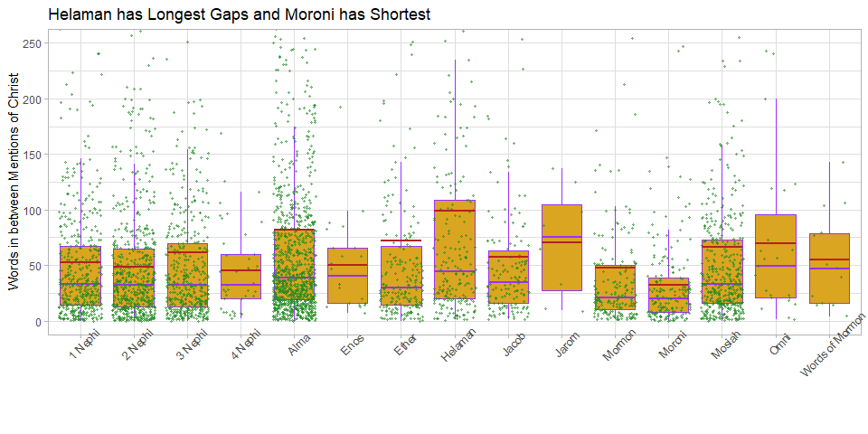

## Wrangling


```r
scriptures <- import("http://scriptures.nephi.org/downloads/lds-scriptures.csv.zip")


bmnames <- read_rds(gzcon(url("https://byuistats.github.io/M335/data/BoM_SaviorNames.rds")))
```


```r
allnames <- str_c(bmnames$name, collapse = "|")

dat <- scriptures %>% 
  filter( volume_id == 3) %>% 
  mutate(count = str_count(scripture_text, allnames),
         key = cumsum(count)) %>% 
  select(book_short_title, chapter_number, verse_number,count, key) %>% 
  filter(!duplicated(key)) %>% 
  fill(., key)


verse <- vector("character", 9001)
bom <- scriptures %>% filter(volume_title == "Book of Mormon")
BOM <- str_c(bom$scripture_text, collapse = " ")
names <- bmnames$name
```


```r
for(i in seq_along(allnames)){
  verse <- str_split(BOM, allnames[i]) %>% 
    unlist() %>% as_tibble(.)
  
  
  
}  

verse <- verse %>% 
  mutate(key = row_number())
data <- right_join(dat, verse, by = "key")
data <- data %>% 
  rename(verse_start = verse_number)

data$verse_start[1] = 1
dat2 <- data %>% 
  mutate(start = case_when(
    !is.na(verse_start) ~ verse_start,
    TRUE ~ lead(verse_start)
  )) %>% 
  mutate(start = case_when(
    !is.na(start) ~ start,
    TRUE ~ lead(start)
  )) %>% 
  mutate(start = case_when(
    !is.na(start) ~ start,
    TRUE ~ lead(start)
  )) %>% 
  mutate(start = case_when(
    !is.na(start) ~ start,
    TRUE ~ lead(start)
  )) %>%
  mutate(start = case_when(
    !is.na(start) ~ start,
    TRUE ~ lead(start)
  )) %>%
  mutate(start = case_when(
    !is.na(start) ~ start,
    TRUE ~ lead(start)
  )) %>%
  mutate(start = case_when(
    !is.na(start) ~ start,
    TRUE ~ lead(start)
  )) %>%
  mutate(end = lead(start)) %>% 
  select(book_short_title, key, value, start, end)
```


```r
dat2 <- dat2 %>% mutate(Book = case_when(
  key < 464 ~ "1 Nephi" ,
  key < 1059 ~ "2 Nephi" ,
  key < 1213 ~ "Jacob" ,
  key < 1235 ~ "Enos" ,
  key < 1243 ~ "Jarom"  ,
  key < 1266 ~ "Omni" ,
  key < 1279 ~ "Words of Mormon" ,
  key < 1739 ~ "Mosiah" ,
  key < 2759 ~ "Alma" ,
  key < 2968 ~ "Helaman",
  key < 3425 ~ "3 Nephi" ,
  key < 3466 ~ "4 Nephi" ,
  key < 3659 ~ "Mormon" ,
  key < 3887 ~ "Ether" ,
  TRUE ~ "Moroni",
)) %>% 
  select(Book, key, value, start, end)

dat2 <- dat2 %>% group_by(Book, key, value, start, end) %>%  summarise(words = stri_stats_latex(value)["Words"])

dat2$end[4070] = 34
dat2$end[4071] = 34
dat2$start[4071] = 34
```

## Vizualization

The mean words between savior names is below, along with each book:


```r
pander(mean(dat2$words))
```

_64.42_

```r
dat2 %>% 
  group_by(Book) %>% 
  summarise(`Mean Words` = mean(words)) %>% 
  kable(caption = "Average Words between Savior names by Book")
```


Table: Average Words between Savior names by Book

Book               Mean Words
----------------  -----------
1 Nephi              52.81857
2 Nephi              48.20336
3 Nephi              61.64770
4 Nephi              45.53659
Alma                 81.80392
Enos                 50.09091
Ether                71.79825
Helaman              98.77990
Jacob                57.80519
Jarom                70.50000
Mormon               47.69948
Moroni               31.89189
Mosiah               66.53043
Omni                 70.04348
Words of Mormon      55.07692

-----

Below I have included the number of refernces to Chirst per book, as well as a look into the ditribution of words between references of Christ. The red lines represent the mean number of words in between references. There are many outliers which extend above the scope of the graphic, they are included in the calculations but not shown as to better compare distributions. The longest string of words in between mentions of Christ starts in Alma 5039and ends in Alma 53:10. It is 4038 words long.

----


```r
dat2 %>% 
  group_by(Book) %>% 
  summarise(`Mentions` = n()) %>% 
  kable(caption = "Savior Mentions by Book")
```


Table: Savior Mentions by Book

Book               Mentions
----------------  ---------
1 Nephi                 463
2 Nephi                 595
3 Nephi                 457
4 Nephi                  41
Alma                   1020
Enos                     22
Ether                   228
Helaman                 209
Jacob                   154
Jarom                     8
Mormon                  193
Moroni                  185
Mosiah                  460
Omni                     23
Words of Mormon          13

```r
dat2 %>% 
  ggplot(aes(Book, words)) +
  geom_boxplot(color = "purple1", fill = "goldenrod", outlier.color = .0001) +
  geom_jitter(color = "forestgreen", size = .75, alpha = .5) +
  stat_summary(fun.y = mean, geom = "errorbar", aes(ymax = ..y.., ymin = ..y..),
                 width = .75, color = "firebrick", size = 1) +
  coord_cartesian(ylim = c(0,250)) +
  theme_light() +
  labs(title = "Helaman has Longest Gaps and Moroni has Shortest", y = "Words in between Mentions of Christ", x = "") +
  theme(axis.text.x = element_text(angle = 45))
```

<!-- -->


